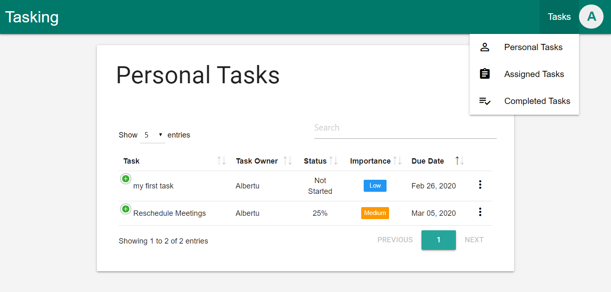
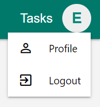
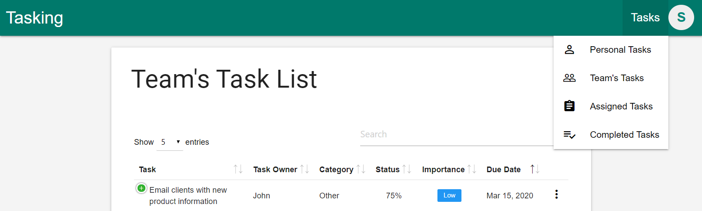
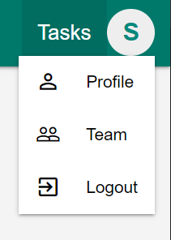
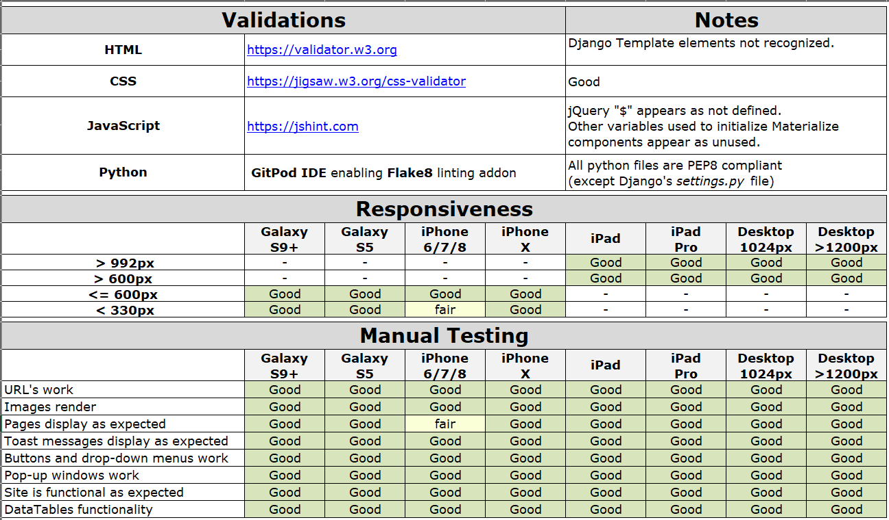

# Tasking


[](https://travis-ci.org/josep-pujol/fsfd-tasking)
[](https://codecov.io/gh/josep-pujol/fsfd-tasking)

This repository contains a solution code for the milestone project of the *Full Stack Frameworks with Django* module at [Code Institute](https://codeinstitute.net/). This is the last step to obtain the Diploma.

Consists on a "Tasks List" or "To-Do" application in which users can organize their tasks or to-dos. Users not only can create and update tasks but as well search, filter or sort tasks.

Most of the functionality is available for free however, users can get additional features by subscribing.
Subscribed users can create a To-Do list with a list of users of their choice, and collaborate online from their PC or mobile phone.

A demo of the app can be viewed [HERE](https://fsfd-tasking.herokuapp.com/)

<br>
<br>

## Table of Contents

1. [**UX**](#ux)
    - [**User Stories**](#user-stories)
    - [**App Overview**](#app-overview)

2. [**Features**](#features)
    - [**Existing Features**](#existing-features)
    - [**Features Left to Implement**](#features-left-to-implement)

3. [**Technologies Used**](#technologies-used)

4. [**Testing**](#testing)
    - [**Manual Testing**](#manual-testing)
    - [**Unit Tests**](#unit-tests)
    - [**Chrome DevTools Audit**](#chrome-devtools-audit)

5. [**Deployment**](#deployment)
    - [**Getting the code up and running**](#getting-the-code-up-and-running)
    - [**Deploy in Heroku**](#deploy-in-heroku)
    - [**Database initial values**](#database-initial-values)
    - [**Database Schema**](#database-schema)

6. [**Credits**](#credits)


##### back to [top](#tasking)

<br>
<br>

## UX

### User Stories

User stories are divided between Free Users and Premium Users, and in function of the operation performed.


#### Free User
As a Free User I want to ...

- Create:  
    - create my own tasks
    - subscribe to Tasking to enjoy Premium features
		
- View:	
    - see all tasks I created	
    - sort and filter tasks for easier retrieval
	- see tasks assigned to me by a Premium User
    - see all completed tasks	
		
- Edit:
	- edit the tasks I create 
	- edit Status fields of other tasks	


#### Premium User
As a Premium User I want to ...	

- Create
    - create my own tasks
	- add users to my Team so they can collaborate
    - create tasks for the users of my Team
	- assign tasks to the users of my Team	
		
- View
	- see all tasks I created
	- see tasks I assigned to the users of my Team
	- see the users that are in my Team	
		
- Edit	
    - edit tasks I create	
	- edit Status fields of other tasks

Mock-up versions of the design phase of this project are included in this repository in the [**readme_files**](readme_files/wireframes-mockups.pdf "Wireframes and Mock-ups") folder.


### App Overview

#### Free User
The app consists of three main sections: 

- Non registered users: Landing page with Sign-in and Sign-up functionality
- Tasks Pages: 
    - Section to manage different Task Lists or To-Do lists
    - The available Task Lists are:
        - "Personal Tasks": Tasks aimed only at the owner of the account - all features available 
        - "Assigned Tasks": Tasks assigned to the user from other registered users of Tasking - restricted features
        - "Completed Tasks": all the Tasks completed by the user

    

- User Pages: section for the owner of the account in which the user profile can be updated and from where users can logout

    


Additionally, modals and popup windows are used to perform actions like Edit the Status of a Task, Update any of the fields of a Task etc.

These actions can be activated by clicking on the menu-dots item on the right-hand side of each Task - if user has right permissions.


#### Premium User
A Premium user has all the sections and features of a Free User plus the following:
- Tasks Pages: 
    - "Team's Tasks": Tasks that the Team Lead or Team Owner assign to other users - all features available

    

- User Pages:
    - "Team": where a Team owner can add users in the Team

     
    

##### back to [top](#tasking)

<br>
<br>

## Features

### Existing Features

- Main Page
    - Navigation bar on top which becomes a side bar for small screens
    - Fixed floating button, with tooltip, to add tasks

- Tasks tables 
    - Pagination, including dropdown menu to select the number of items per page
    - Search and Sorting functionality for most fields in the Table
    - Expand icon per Task, left side, which allows a user to see additional fields of a Task. Especially useful when using a device with small screen.
    - Menu-dots per Task, right side, with options to
        - Edit the Status of a Task. Opens a pop-up window with options
        - Edit any of the fields of a Task. Redirect to Edit Tasks page

- Pop-up window to edit Status of a Task
    - Drop-down menu with available options to select
    - Selecting "Completed" option will set completion date of the task and move task to "Completed Tasks" list
    - Selecting "Started" option will set the start date of the task to the current date
    - Selecting "Not Started" option will reset the start time of the Task to blank
    - The Selection of any of the other options will not affect the start or end time of a Task, unless the "Started" option was not previously selected
    
- Pages to Add or Edit Tasks
    - Add the "Task Name"; with validation, mandatory field
    - Select a "Task Owner" from the dropdown; or leave default option, current user
    - Select a "Task Category" from the dropdown; or leave default option "Undefined"
    - Select a "Task Status" from the dropdown; or leave default option "Not Started"
    - Add a "Task Description"; optional field
    - Select the "Due Date" of the Task from a Calendar popup window; with validation or leave current date as default
    - Select the "Task Importance" from the dropdown; or leave default option "Low"

- Profile Page
    - Update User Profile information like username, email address ...
    - Update User Password

- Team Page
    - See list of Collaborators in Team
        - Sort and search the list of Collaborators in your Team by username or email address
        - Includes Pagination
    - Add a User to the list of Collaborators in Team

- User Accounts & Permissions
    - Login
    - Logout
    - Register as User in Tasking
    - Reset Password, when forgotten, by receiving an email with instructions
    - Permissions for Free and Premium Users (see [**App Overview**](#app-overview) for more info):
        - Free User 
            - can only create or edit Personal Tasks
            - doesn't have access to features to manage a Team
        - Premium User 
            - can create and edit Personal Tasks, and Tasks aimed to other Users in a Team
            - full access to features to manage a Team


### Features Left to Implement

In the future, it could be nice to implement additional options to duplicate or delete tasks, and to allow a Team owner to remove a user from a Team.

As well, the possibility to manage categories or to get alerts and notifications could be nice features to implement.

##### back to [top](#tasking)

<br>
<br>

## Technologies Used

The main technologies used are:
- [GitPod](https://gitpod.io/)
    - Online IDE used to develop this project
- [Python](https://www.python.org/)
    - Main language used to build the application
- [Django](https://https://docs.djangoproject.com/en/2.2/)
    - Web application framework for **Python**
- **HTML**, **CSS** and **JavaScript**
    - Base languages used to create the site frontend
- [Materialize](https://materializecss.com)
    - Used **Materialize 1.0.0** for a responsive layout and styling
- [DataTables](https://datatables.net)
    - Plugin for **jQuery** that adds interactive features to data stored in **HTML** tables
- [JQuery](https://jquery.com)
    - **JQuery** as a dependency for **DataTables**
- [GitHub](https://github.com)
    - Used as repository of the project 
- [ElephantSQL](https://www.elephantsql.com/)
    - PostgreSQL as a service used during development
- [Heroku](https://heroku.com)
    - To deploy the project
- [Heroku Postgres](https://elements.heroku.com/addons/heroku-postgresql)
    - Relational Database based on PostgreSQL as main point of information storage
- [Travis](https://travis-ci.org/)
    - Continuous integration and testing
- [Codecov](https://codecov.io/)
    - Coverage reports
- [SendGrid](https://sendgrid.com/)
    - SendGrid API is used to email users that request a password reset
- [Stripe](https://stripe.com/docs/api)
    - Stripe API to process payments when users subscribe 

##### back to [top](#tasking)

<br>
<br>

## Testing

### Manual Testing

- All code used on this site has been manually tested to ensure everything is working as expected. Tests include:
    - Site responsiveness from small mobile up to 17" desktop screens
        - Content is displayed correctly for screens of small mobiles to 17" desktop screens
        - Content is overflowing for screens smaller than 330 px
    - Functionality:
        - Loading all pages
        - Links and buttons are working
        - Popup windows and its contents are opening correctly
        - Popup windows are performing the intended actions
        - DataTables functionality like Search, Sort, Pagination and Table wrapping is working correctly
    - Data entry and editing
        - Added several tasks using most popular browsers
        - Added tasks with empty fields for validation
        - Added tasks with empty fields to test default values

- Site tested with the following browsers
    - Google Chrome v80 (mobile and desktop version)
    - Microsoft Edge v44 (desktop version)
    - Mozilla Firefox v73 (mobile and desktop version)
- Site tested on real devices
    - Dell Desktop PC model Precision T5810XL
    - Samsung Galaxy S8 SM-G950F
    - see Matrix below for virtual devices used on Tests

    


### Unit Tests
[](https://codecov.io/gh/josep-pujol/fsfd-tasking)

Automatic tests with over 90% coverage are included in this repository. A detailed report can be seen on [**codecov.io**](https://codecov.io/gh/josep-pujol/fsfd-tasking). As a summary, tests include:
- Pages accessible and rendering the right template
- CRUD operations for Tasks, Teams and Users
- Forms validation
- User access to the site with different permissions
- Helper functions

Automatic Tests to be implemented:
- Stripe payments
- User registration process

Additionally, [Travis-CI](https://travis-ci.org/) was used for Continuous Integration. See live badge below:

[](https://travis-ci.org/josep-pujol/fsfd-tasking)


### Chrome DevTools Audit

- Files with the tests ran in Chrome DevTools Audit can be found in this repository in the folder [**test_files**](readme_files/test_files "Chrome DevTools Audit"). The tests were done on the [**Landing**](https://fsfd-tasking.herokuapp.com/) and the [**Tasks**](https://fsfd-tasking.herokuapp.com/) pages
- As a summary:
    - Landing Page: results about 90 for Performance, Accessibility, Best Practices and SEO
    - Tasks Page: results around 70 for Performance and Best Practices, and about 90 for Accessibility and SEO
    - Runtime settings: 
        - Emulated Nexus 5X device
        - User Agent (network):  Mozilla/5.0 (Windows NT 10.0; Win64; x64) AppleWebKit/537.36 (KHTML, like Gecko) Chrome/80.0.3987.132 Safari/537.36


##### back to [top](#tasking)

<br>
<br>

## Deployment
 
### Getting the code up and running

0. The following instructions are meant for a Linux System running Python3
1. First it is recommended to create a virtual environment
2. Create your own repository
3. Download or clone this repository by running the ```git clone <project's GitHub URL>``` command
4. Install Python packages from ```requirements.txt``` file - from Terminal type ```pip install -r requirements.txt```
5. Add the following environmental variables in your environment:
    - ```DATABASE_URL```: connection string to your Database. [elephantsql](https://www.elephantsql.com/) was used in this project
    - ```IP```: set to ```0.0.0.0```
    - ```PORT```: set to ```8080```
    - ```SECRET_KEY```: Django secret key. You can generate one on the site [djecrety](https://djecrety.ir/)
    - ```SENDGRID_API_KEY```: create a SendGrid account to get a key
    - ```STRIPE_PUBLIC_KEY```: create a Stripe account to get a key
    - ```STRIPE_SECRET_KEY```: create a Stripe account to get a key
6. To have the Database ready to run the app do the following in your Terminal (see section [**Database initial values**](#database-initial-values)):
    - Make migrations typing ```python3 manage.py makemigrations```
    - Migrate typing ```python3 manage.py migrate```
    - Notice a default superuser is created with username and password ```admin```
7. Run Unit tests to ensure everything is working properly, type ```python3 manage.py test``` in your Terminal
8. Go to Django Admin and change the default Superuser password


### Deploy in Heroku

0. If previous steps ran successfully, do the following to deploy the app in Heroku 
1. Frist you need to create an account in Heroku
2. Create an Heroku app
3. In the "Resources" section Add the "Heroku Postgres" add-on
4. In the "Settings" section make sure you have the same environmental variables previously discussed
5. In the "Deploy" section: 
    - Select "GitHub" as a source in the "Deployment method" subsection 
    - Click the "Deploy Branch" button in the "Manual Deploy" subsection
6. Open the given Heroku URL to test that the application is up and running
7. Go to Django Admin and change the default superuser password
8. If issues, please have a look at the deployment logs in Heroku


### Database initial values

The Database migrations automatically create a superuser and the following tables with default values:
- ```superuser``` : the administrator user to access Django Admin, with credentials username  ```admin``` and password  ```admin``` 
- ```team_team``` (table): table that stores information related to Teams
    - A default Team called ```tasking``` is set for all users
- ```team_userteam``` (table): table to store the relationship of a User with a Team. In other words, which Users belong to each Teams
    - A relationship between the default Team ```tasking``` and all users is created by default
    - The superuser ```admin``` is the Team Owner of the ```tasking``` Team
- ```task_category``` (table): used in dropdown menus to classify tasks in different category groups 
    - The category groups are:  ```undefined```,  ```admin```, ```meetings```, ```other```, ```planning```, ```projects```, ```training``` and ```travel```   
- ```task_importance``` (table): with values to define the importance or urgency of a Task to be completed
    - A Task can be labelled with Importance values: ```low```, ```medium``` and ```high```
- ```task_status``` (table): provide information to the user about the degree of completion of a Task, and sets the start and completed date of a Task
    - The status available are: ```not started```, ```started```, ```25%```, ```50%```, ```75%``` and ```completed```
    - Notice that some status modify the start or completed date of a Task:
        - For example, when the status ```started``` is selected, the Task start date is set to the current date
        - When the status ```completed``` is selected, the Task completed date is set to the current date


### Database Schema


##### back to [top](#tasking)

<br>
<br>

## Credits

Inspired by the [Materialize](https://materializecss.com) admin dashboards built by [Pixinvent.com](https://pixinvent.com/materialize-material-design-admin-template/html/ltr/vertical-modern-menu-template/).
Wallpaper images taken from [pixabay.com](https://pixabay.com/), and multidevice mock-ups, on this README file, were generated on [techsini.com](http://techsini.com/multi-mockup/).

Many thanks to my mentor [Sindhu Kolli](https://github.com/itssindhu13) for her great advise and suggestions.


##### back to [top](#tasking)
